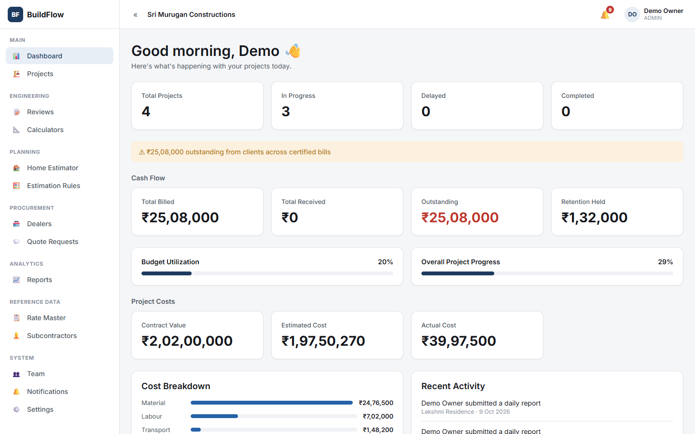
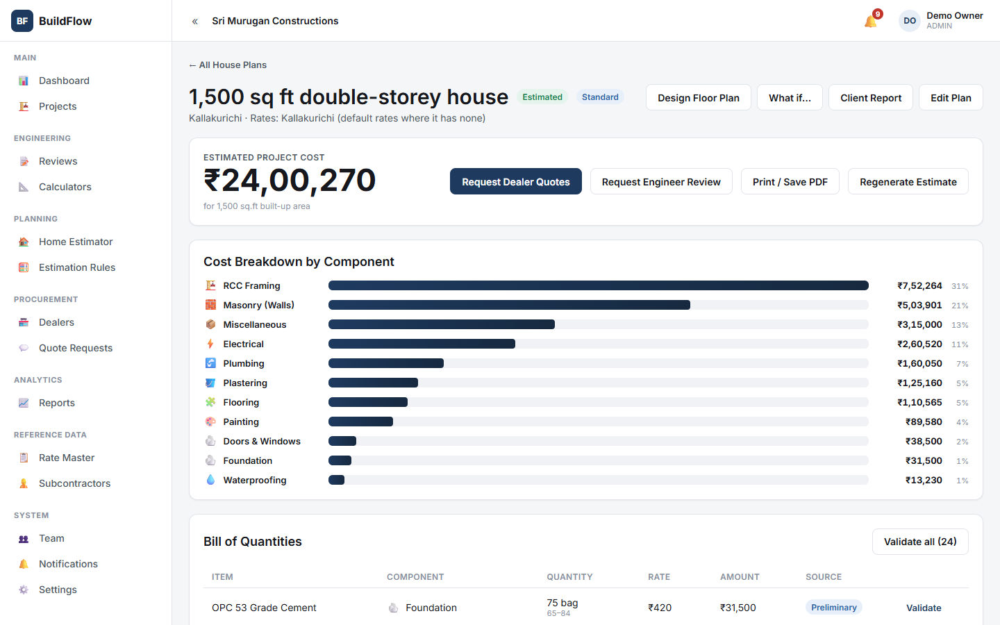
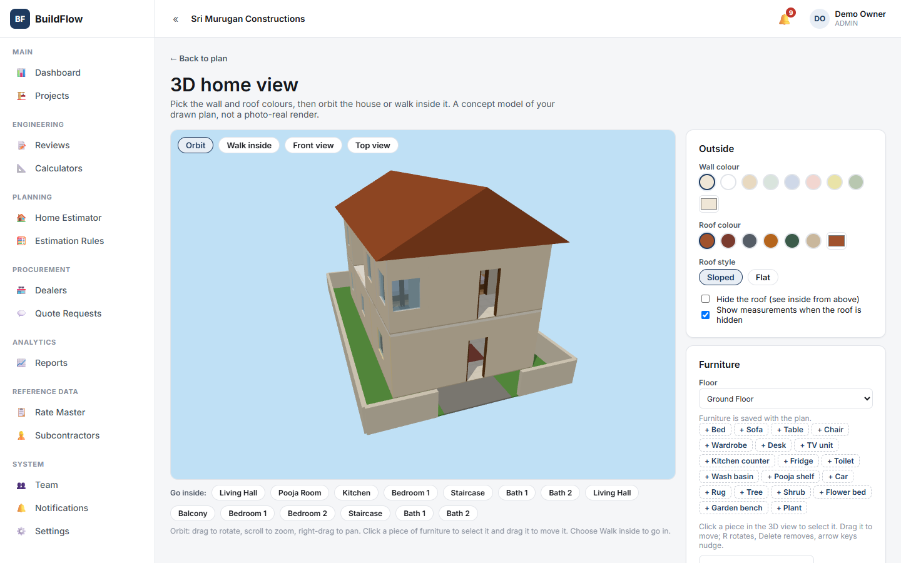
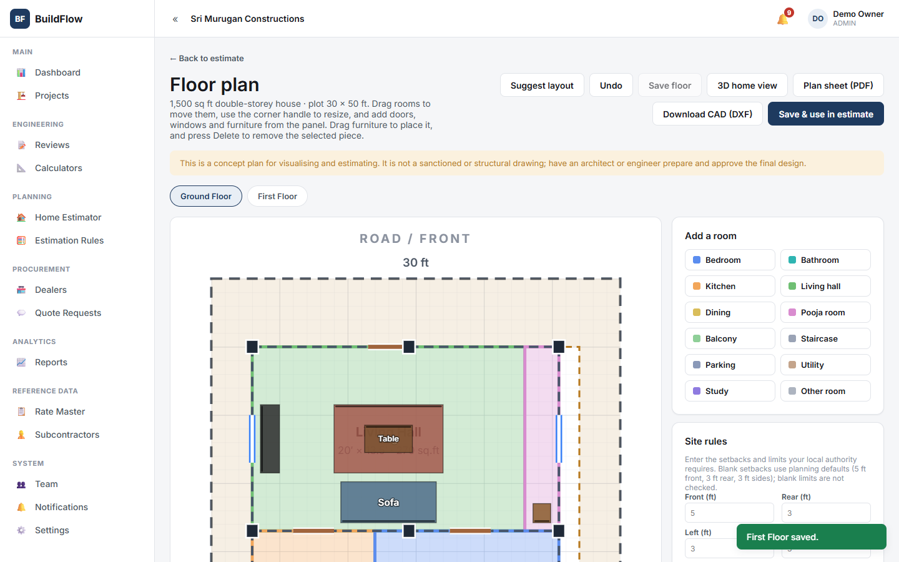
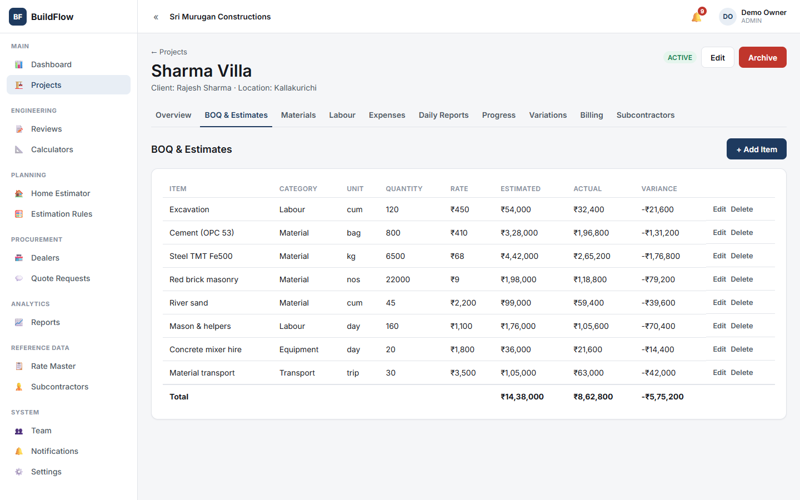
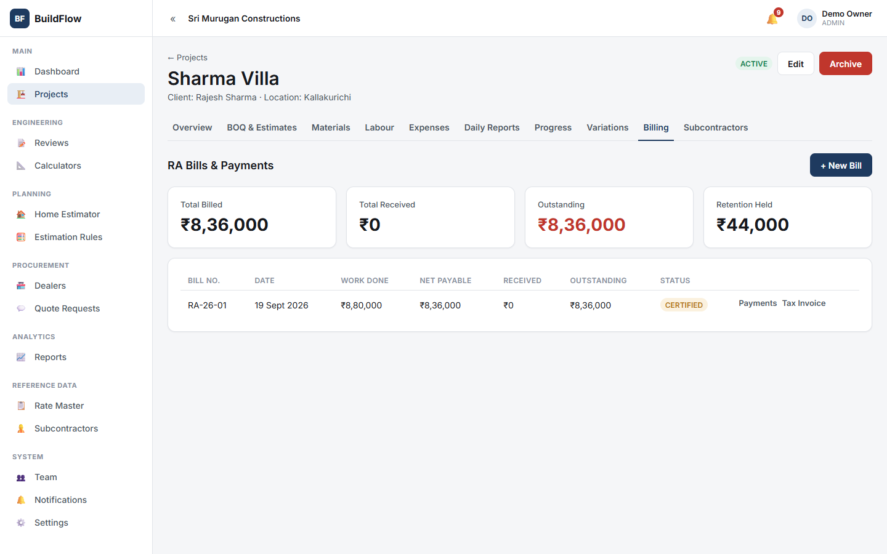
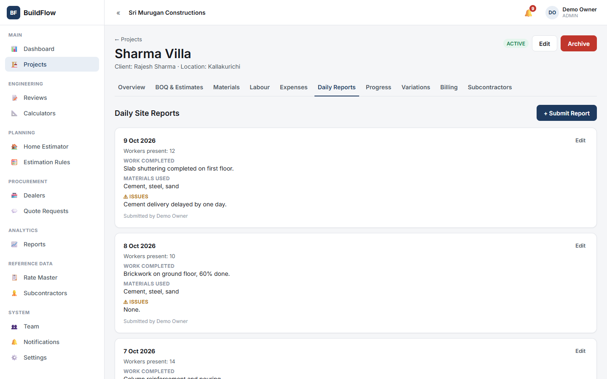
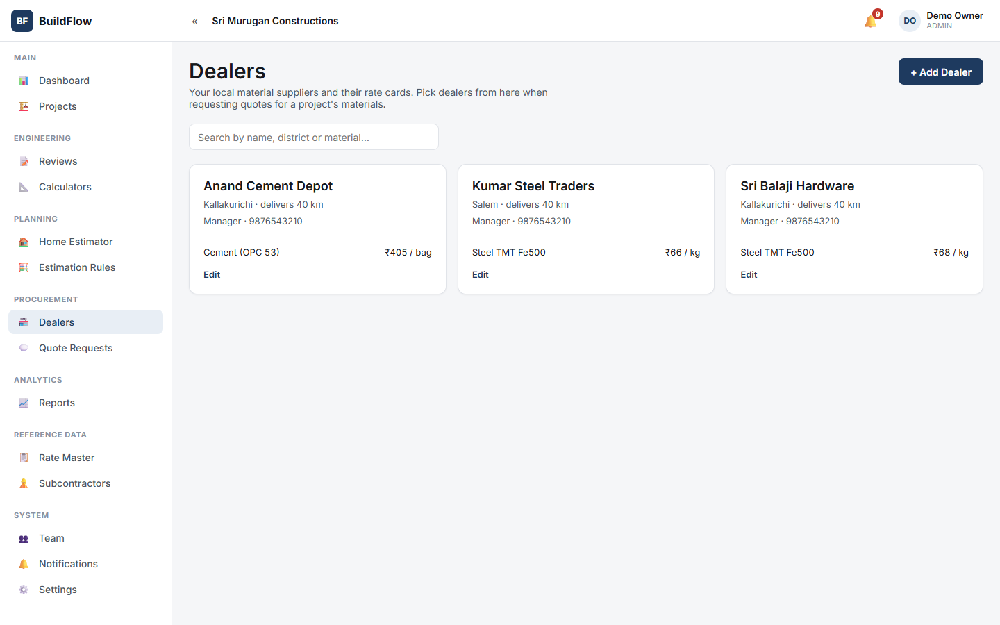

# BuildFlow – Construction Project Management System

A multi-tenant web app for construction businesses, covering the work from estimating a project to site execution and billing.

> **Status:** under development. Selected modules are functional. Built with the help of AI coding assistants.

## Screenshots

| | |
|---|---|
|  **Dashboard**: projects, cash flow, costs, recent activity |  **Home Estimator**: cost breakdown by component |
|  **3D home view**: orbit, walk inside, edit colours and furniture |  **Floor plan editor**: suggested layout, rooms, doors, furniture |
|  **Bill of Quantities**: estimated vs actual cost |  **RA bills and payments** |
|  **Daily site reports** |  **Dealers** and their rate cards |

*Screenshots use sample demo data.*

## Tech stack
- **Backend:** Java 21, Spring Boot 4, Spring Security (JWT), Spring Data JPA, MySQL
- **Frontend:** React 19, TypeScript, Vite, React Router, Axios, Three.js
- **Tests:** JUnit / Spring Boot Test with H2 (auth flow and tenant isolation)

## Features
- **Auth and access:** register, login, JWT access/refresh tokens, roles (Admin, Project Manager, Engineer), per-business data isolation
- **Projects:** create, edit, status changes, archive, dashboard
- **Estimation:** Home Estimator from house requirements, configurable estimation rules, rate master, BOQ generation, floor plan editor, 3D home view, calculators
- **Site management:** daily reports, progress tracking, expenses, labour, materials, variations, subcontractors
- **Billing:** RA bills with certification, GST invoices, payment tracking, Tally-compatible XML export
- **Procurement:** dealer directory and rates, quote requests with side-by-side comparison
- **Quality and oversight:** engineer reviews, reports, notifications
- **Offline support:** submissions made without a connection are queued and sent when it returns

See [ROADMAP.md](ROADMAP.md) for planned work.

## Project structure
```
backend/    Spring Boot API (com.buildflow.*, one package per feature)
frontend/   React + TypeScript app (src/features/*, one folder per feature)
```

## Running locally

### Backend
Requires Java 21 and a running MySQL server.
```bash
cd backend
./mvnw spring-boot:run
```
Runs on port 8080. Defaults can be overridden with environment variables:

| Variable | Purpose | Default |
|---|---|---|
| `DB_URL` | JDBC URL | local MySQL, `buildflow` database |
| `DB_USERNAME` / `DB_PASSWORD` | Database login | `root` / `root` |
| `JWT_SECRET` | Token signing key | development-only placeholder |
| `CORS_ALLOWED_ORIGINS` | Allowed frontend origin | `http://localhost:5173` |

**Set your own `JWT_SECRET` and database credentials before any real deployment.**

### Frontend
```bash
cd frontend
npm install
npm run dev
```
Runs on http://localhost:5173.

### Tests
```bash
cd backend
./mvnw test
```
